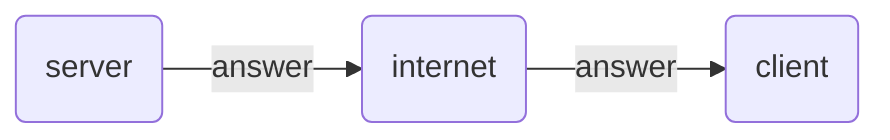
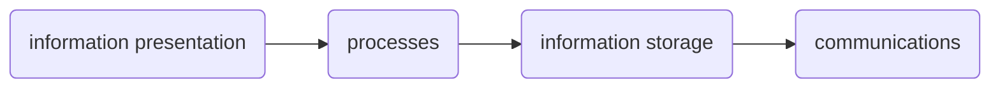
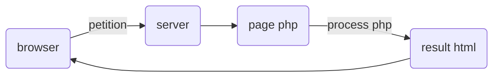

### Client/server communication process

This system is a model that adapts to the service we want to implement.
It allows us to increase performance, databases, networks and operating systems.
In addition, it can be considered a system with advantages in terms of security, since the server is in charge of controlling access to its data,
that is, the server grants us permission to access.

### Components

### Advantages

- Facilitates integration between different systems and shares information

- Have a greater interaction with the user

- Provides the different areas of a company generate a work order where each sector

- Great utility

### Disadvantages

- It requires someone with experience to operate it

- Require you to go through validation processes

- Important limitation to economic costs

### Loading process

As can be seen in the graph, the loading process starts from the browser, which will be in charge of sending the request to the server, that is, the service consumer component
and the server the service provider process. Once it reaches the server, it will send it to the php page that will be in charge of processing it and documenting the result through
the HTML, and finally it will return to the browser.

