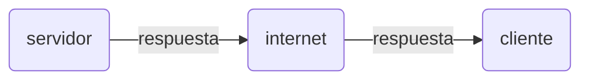
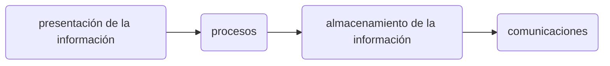
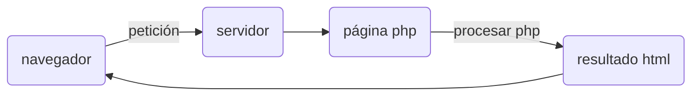

### Proceso de comunicación cliente/servidor
Este sistema es un modelo que se adapta al servicio que queremos implementar. 
Nos permite aumentar el rendimiento, bases de datos, redes y sistemas operativos.
Además se puede considerar un sistema con ventajas en cuanto a seguridad, ya que el servidor es el encargado de controlar el acceso a sus datos, 
es decir, el servidor nos concede permiso para poder acceder.

### Componentes

### Ventajas

- Facilita la integración entre diferentes sistemas y comparte información 

- Tienen una mayor interacción con el usuario

- Proporciona las diferentes áreas de una empresa generar un orden de trabajo en donde cada sector 

- Gran utilidad

### Desventajas

- Se requiere de alguien con experiencia para su funcionamiento

- Requieren que pases por procesos de validación

- Limitación importante a los costos económicos 

### Proceso de carga

Como se puede ver en el gráfico,el proceso de carga parte desde el navegador que será el encargado mandar la petición al servidor,es decir, el componente consumidor de servicios 
y el servidor el proceso proveedor de servicios.Una vez llegado al servidor ,este lo mandará a la página php que será la encargada de procesarlo y documentar el resultado mediante 
el HTML, y por último volverá al navegador.

