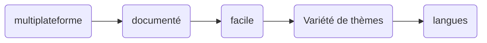

### Qu'est-ce qu'Hugo ?

Hugo est un `framework`, c'est-à-dire qu'il nous permet de `créer` des sites Web avec des `modèles` prédéfinis. Il permet aussi de générer des sites web statiques, comme un `blog` ou un portfolio.Les fichiers de contenu sont créés par l'utilisateur en html ou en markdown qu'Hugo traduira en html.
ss
### Caractéristique


### Comment installer Hugo sur Ubuntu

Si vous n'avez pas installé snap 
```
sudo apt-get install snapd
```

Une fois le snap obtenu, nous allons installer Hugo 
```
sudo apt-get install hugo
```

Nous installerons dans notre cas Visual Studio Code pour pouvoir éditer notre site Web
```
code d'installation sudo snap --classic
```

Nous allons créer le nom du site 
```
nouveau site hugo <page>
```

Une fois que nous aurons accédé au site, nous passerons au dossier des thèmes 
```
thèmes cd
```

Dans ce dossier, nous allons cloner notre modèle via SSH ou http à partir d'un référentiel, tel que GitHub 
```
git clone https://github.com/theNewDynamic/gohugo-theme-ananke.git relearn
```

Nous allons aller dans notre dossier de page et entrer 
```
code .
```

Dans le fichier de configuration (config.toml) nous allons changer le titre par le nom du template 
```
theme =['hugo-PaperMod']
```

Une fois toutes les étapes précédentes terminées, nous pouvons voir notre site Web à partir de localhost 
```
serveur hugo
```


### Installer Hugo sous Windows

Pour l'installation, nous devons aller au lien suivant
```
https://github.com/gohugoio/hugo/releases
```

Nous téléchargeons la version que nous voulons dans un zip
```
hugo_extended_x.x.x_windows-amd64.zip
```

L'installation se fait manuellement

Nous extrayons le zip et déplaçons le fichier 
```
Hugo.exe
```

vers le chemin 
```
C:\Hugo\bin 
```

Dans le moteur de recherche Windows, nous entrons dans 
```
Modifier les variables d'environnement système
```

Les Propriétés système apparaîtront et cliquez sur 
```
Variables d'environnement
```

Dans la liste nous chercherons la variable Path, et nous ajouterons 
```
C:\Hugo\bin
```

On redémarre et on aura Hugo et l'accessibilité.


### Ressources supplémentaires

https://gohugo.io/content-management/

https://github.com/gohugoio/hugo





