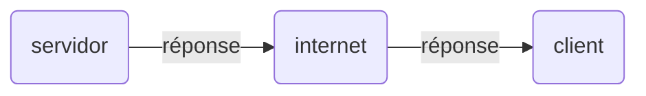
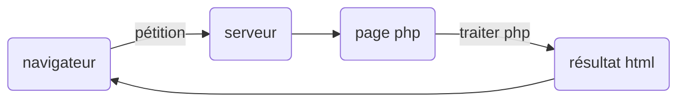

### Processus de communication client/serveur

Ce système est un modèle qui s'adapte au service que l'on veut mettre en place.
Il nous permet d'augmenter les performances, les bases de données, les réseaux et les systèmes d'exploitation.
De plus, il peut être considéré comme un système présentant des avantages en termes de sécurité, puisque le serveur se charge de contrôler l'accès à ses données,
c'est-à-dire que le serveur nous accorde l'autorisation d'accéder.

### Composants

### Avantage

-Facilite l'intégration entre les différents systèmes et partage les informations

-Avoir une plus grande interaction avec l'utilisateur

-Fournit les différents secteurs d'une entreprise génèrent un ordre de travail où chaque secteur

-Grande utilité

### Désavantages

-Il nécessite une personne expérimentée pour le faire fonctionner

-Vous obliger à passer par des processus de validation

-Limitation importante des coûts économiques

### Processus de chargement

Comme on peut le voir sur le graphique, le processus de chargement commence à partir du navigateur, qui sera chargé d'envoyer la requête au serveur, c'est-à-dire le composant consommateur de service.
et le serveur le processus du fournisseur de services. Une fois qu'il atteint le serveur, il l'enverra à la page php qui sera en charge de le traiter et de documenter le résultat via
le HTML, et enfin il reviendra au navigateur.

---

---
